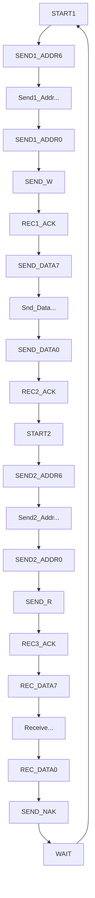

# I2C-Protocol-On-Basys3

Inter-Integrated Circuit (I2C), I^2 C, or even IIC, is a **two-wire** data transfer bus. Philips Semiconductor (now **NXP** Semiconductors) invented the protocol in 1982.

## I2C Slave-> MPU6050

Accelerometer, Gyroscope, Temperature Sensor

Max I2C clock frequency = 400KHz

7-bit I2C Address.

0th and 7th bit is hard-coded to '0'.

Default I2C Address is `0x68`.

### Register map


```
Temperature in degrees C = (TEMP_OUT Register Value as a signed quantity)/340 + 36.53     // (Everithing in Decimal value)
```

# Verilog Code

1. Let's take SCL frequency = 10KHz. T = 100 u-sec
2. For proper operation (Start condition during High state of clk, data change during low state of clk...)
3. Let's take operating clk frequency = 20*10KHz = 200KHz. T = 5 u-sec
   
(One clk cycle divided into 20 sub-parts)


## Code 1 (Only Receive from Slave Address)


When ACK or Data bits come from slave, master releases SDA line means High Impedance state (Z)


### State Diagram


### Output Waveform


1. Start condition (SCL high, SDA data changesfrom 1 to 0)


2. Send Address bits and RW (SCL low, SDA data changes, checked at posedge)


3. Receive ACk from sensor and data bits and Master sends ACK for more data to receive (ACK->0 for 1 entire scl period)


4. Slave sends more data and master sends NACK not to receive anymore data (NACK->1 for 1 entire scl period)


5. Send STOP signal by Master (SCL high, SDA data changesfrom 0 to 1)

***But here we're not stopping the data-transfer, we're continiously receiving data... So, sending repeated start bit

6. Repeated start bit


## Code 2 (Receive data from internal Reg of Slave)

(But in most of the sensor, they use following format)
Start --> Send Slave Addr --> Send Slave Internal Reg Addr --> Receive Data --> Stop.


### States



                   
                     
                  

### Using Arduino and MPU6050


### RTL Code Simulation on Viavado


### Using FPGA Board and MPU6050


